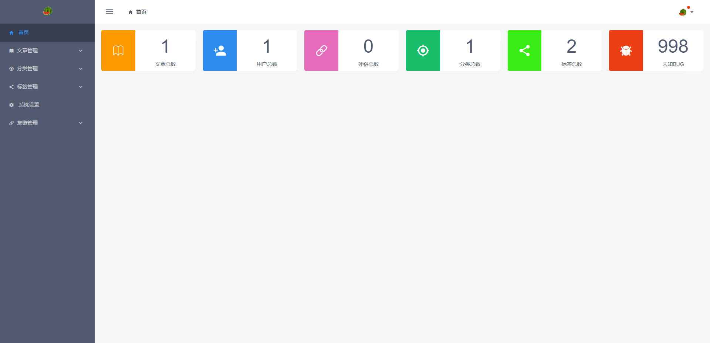
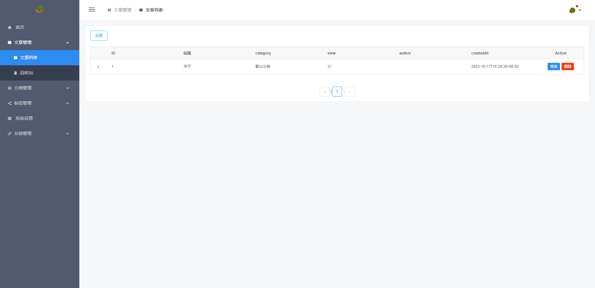

# blog-admin

[blog](https://github.com/ChangSZ/blog) 后台管理系统


## Project setup
```bash
npm install
# node version: v16.20.1 
```

### Compiles and hot-reloads for development
```
npm run serve
```

### Compiles and minifies for production
```
npm run build
```

### Lints and fixes files
```
npm run lint
```

### Customize configuration
See [Configuration Reference](https://cli.vuejs.org/config/).

页面效果:

 登录: 
 注册: 
 首页: 
 列表: 